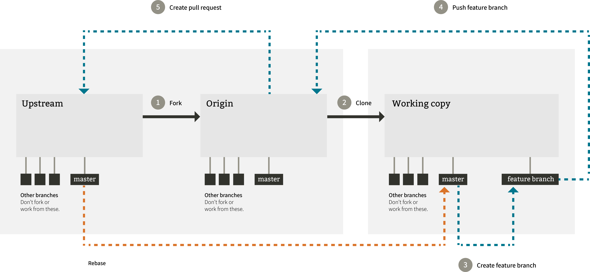

# Macaw Interactive git workflow

## Forks with private feature branches

There are many opinions on this subject and it takes time to wade through all of them. The “Forking with feature branches workflow” is one workflow that has been adopted by a very large crowd of open-source developers, including us.

This workflow is characterised by the fact that each of the developers working on the project is based on two repositories:

1. The main, common repository, which is the central place for every developer, called upstream

2. His own repository, which is the clone of the main one, called a fork and is also known as origin

There are a lot of advantages to this workflow, such as very thoughtful code merging, which can be watched by a chosen person (and could be the only person having the permissions to modify the main repository). Another is pull requests, which let developers perform code reviews with ease.



## How does this work

### Create a new repository on the organization level

This is done on Github. Add the necessary policies to the master branch. This means no commits are allowed anly pull requests

### Fork the repository from the organization level to your private Github

This is done on Github. When forked to your private Github, you can clone the repository and work like usual

```bash
git clone https://github.com/mlouage/my-awesome-project
```

At this point we need to tell Git which is the upstream. The upstream is the repository on the organizational level

```bash
git remote add upstream https://github.com/macaw-interactive/my-awesome-project
```

### Start working on features and push them to origin

You can new create new branches and work on them.

```bash
git checkout develop
git fetch upstream
git rebase upstream/develop
git checkout -b feature/[branch-name]
```

Commit, push, pull, ... When your feature is ready it is time to get those changes in master.

### Clean up your work and create a PR for master

Once your feature is ready, create a PR in Github and select the upstream master as destination.
Your PR will be reviewed by your coworkers and merged into master on upstream.